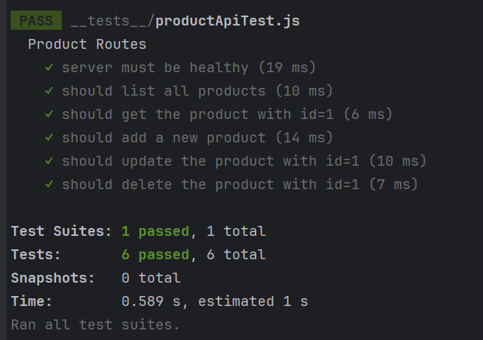

## Runtime Setup

1. NPM Version: 10.5.0
2. Node Version: 21.4.0

## Install Dependencies (staying in the backend directory)

1. Install production and dev dependencies
   ```bash
   npm install
    ```

## Run Test Script

0. Before you run the test cases, you need to setup postgres database and put the appropriate values in `.env` file. Then run `export $(grep -v '^#' .env | xargs)` if running on linux or `(for /F \"tokens=*\" %i in (.env) do set %i)` if running on windows, in the same shell/command prompt.

1. Run test script defined in `package.json` using the following command.
    ```bash
   npm test
    ```
   Make sure PostgreSQL server is running and accessible from the runtime. You need to set correct env variable values in the provided `.env` file. 

## Test Cases Defined

- Currently, test case for only one of the MVPs, managing product details, is implemented. 
- All the current and future test cases are present in `__test__` directory.
- `jest` is used for implementing unit tests.

Following image shows the expected test case output for the product API.


## GitHub Actions for Test Case

- Github workflow is configured to test the unittests in GitHub actions. The workflow first setups a postgres service which is accessible from the runner job where we use the same commands as above to run the test cases.