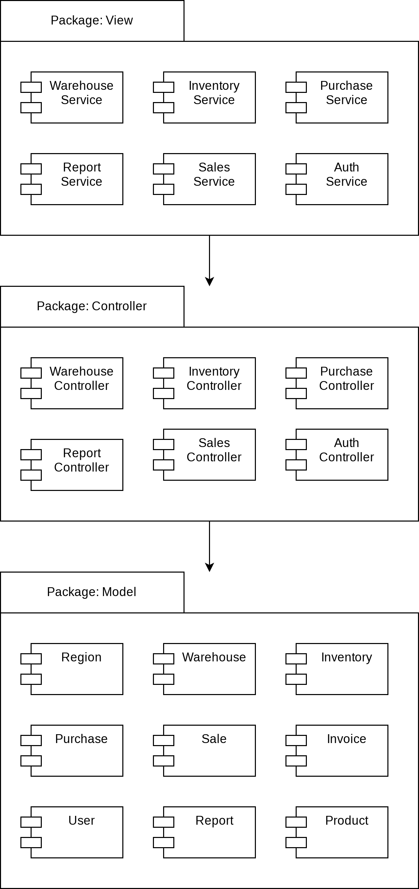
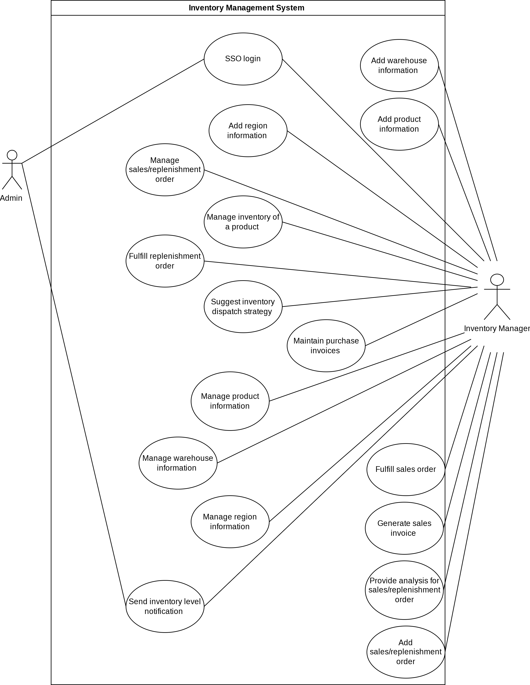
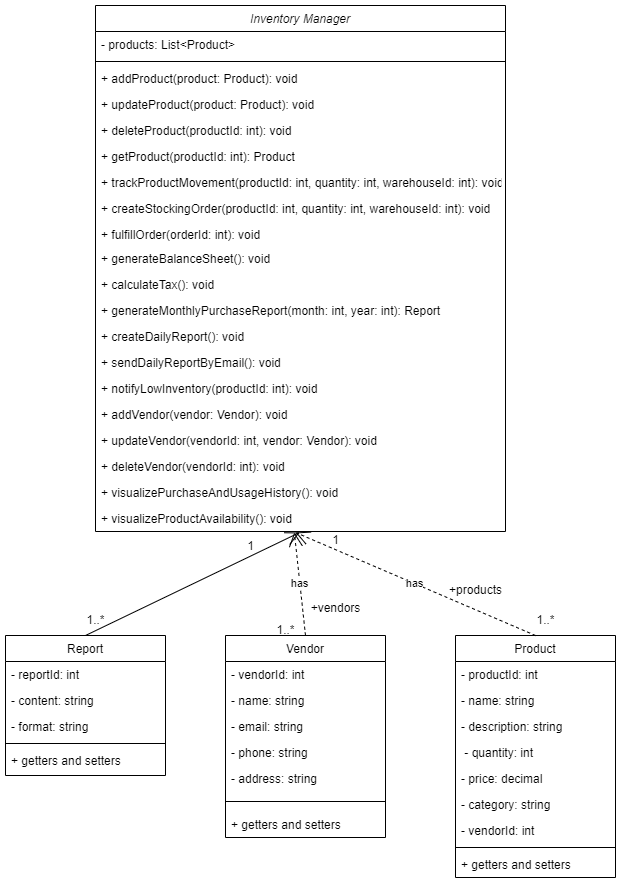

# PROJECT Design Documentation

## Team Information
* Team name: Group 6
* Team members
  * Mukadam, Uzair, umm7905, GitHub ID: uzairmukadam
  * Naik, Praneet Santosh, pn3270 GitHub ID: Praneet-26
  * Patel, Jheel Nikulkumar, jp9959, GitHub ID: pateljheel
  * Setpal, Ayush, as8675

## Executive Summary

Our proposed Inventory Management System (IMS) is designed to address the complex needs of businesses with multiple warehouses distributed across various regions within a country. This system aims to streamline and enhance inventory control, product management, and reporting capabilities, providing an efficient solution for owners and managers.

### Key Features:

- Product Management:
  - Easily add, update, or delete products.
  - Keep track of product quantities in and out of warehouses.

- Stocking Orders:
  - Effortlessly create and manage stocking orders.
  - Automatically update inventory when orders are fulfilled.

- Financial Tracking:
  - Generate automated balance sheets for a quick financial overview.
  - Calculate taxes in real-time for accurate reporting.

- Reports and Notifications:
  - Monthly purchase reports in PDF/Excel formats.
  - Schedule automated daily reports via email.
  - Receive email alerts for low inventory levels.

- Vendor Management:
  - Manage vendor information associated with inventory products.

- Single Sign-On (SSO):
  - Secure and easy login using Single Sign-On with customer email domains.

Our simplified IMS aims to enhance your daily operations, offering a user-friendly interface and essential functionalities. With a focus on efficiency and automation, this project will empower your team to manage inventory effectively and make informed decisions.

## Requirements

1. Product Management: User shoule be able to add new products, update existing product details, and delete products as needed.
2. Real-time Quantity Tracking: User shoule be able to update product quantities as they enter or leave each warehouse.
3. Stocking Orders: Users should be able to create and manage stocking orders efficiently through the system.
4. Automated Inventory Update: Upon fulfillment of stocking orders, user should be able to mark the order fulfilled and then the system should automatically update inventory levels for the corresponding products.
5. Financial Tracking: The system should be able to automatically generate a balance sheet, providing an overview of financial status, upon user request.
6. Real-time Tax Calculation: System should be able to create real-time tax calculation for accurate financial reporting.
7. Reports and Notifications: Users should be able to generate detailed monthly purchase reports in PDF/Excel formats.
8. Automated Daily Reports: Implement a scheduling feature to send automated daily reports via email.
9. Low Inventory Notifications: Set up an email notification system to alert users when inventory levels for any product are low.
10. Vendor Management: Enable users to create and manage vendor information associated with inventory products.
11. Single Sign-On (SSO): Implement Single Sign-On using customer email domains for secure and seamless user login.
12. General System Requirements: The system should have an intuitive and easy-to-use interface for all users.

### Definition of MVP
An MVP is the initial version of a product that includes just enough features to be usable by early customers. The goal is to collect validated learning about customers with the least effort. In other words, it’s the version of a product that allows a team to observe actual customer behavior and determine whether people will actually use or purchase the product. The key premise behind an MVP is that seeing what people do with the product is more reliable than asking them what they would do.

### MVP Features
1. Add a new product, update/delete existing products.
2. Update the quantity of a product in a warehouse once it leaves/added to the warehouse. 
3. Create/manage stocking orders and update the inventory once the order has been fulfilled.
4. Automated balance sheet and tax calculation.
5. Generate a PDF/Excel report for all the monthly purchases made.
6. Create/manage automated daily reports delivery by email.
7. Notify by email if inventory is low for any product.
8. Create/manage vendor information on inventory products.
9. SSO-based login using customer email domain.
10. Visual representation of purchase and usage history.
11. Visual representation of product availability based on warehouse location.

## Architecture and Design

### Software Architecture
MVC: The problem domain of the app can be modeled in a way which makes MVC a good choice for software architecture. Here the entities which make up the system can be handled easily using the MVC architecture. It allows for the following development features:

1. Separation of concerns: Model representing the business logic, data design and retrieval and entities management. View will handle the representation of the entities to the users according to the business logic. And Controller coordinating the flow of data between the View and Model.
2. Code re-usability: As it is know and tested that MVC is modular with reusable pattern hence increasing development efficiency.
3. Scalable: Each component can be scaled independently eliminating bottlenecks.
4. Collaboration due to separation of concerns.
5. Better UI/UX due to separation of View component from business logic.

### Use Cases

The interactions between users and the inventory management system are shown in the use case diagram. It covers routine tasks like managing region, warehouse, and product information, as well as SSO login. It also includes inventory management activities including providing notifications, recommending dispatch plans, and keeping track of inventory levels. It displays adding, monitoring, and fulfilling orders as well as creating bills and offering sales analysis for sales. This demonstrates how different user roles use the system to carry out their responsibilities. The use case diagram summarises the key user interactions with the inventory management system and offers a visual depiction of every MVP component mentioned above.

### Class Diagram

**InventoryManager** is the main class responsible for managing products, vendors, orders, reports, and visualizations.\
**Product** represents the individual products in the inventory, with properties such as ID, name, description, quantity, price, category, and vendor ID.\
**Vendor** represents the vendors supplying the products, with properties such as ID, name, email, phone, and address.\
**Report** represents the reports generated by the system, with properties such as ID, content, and format.
